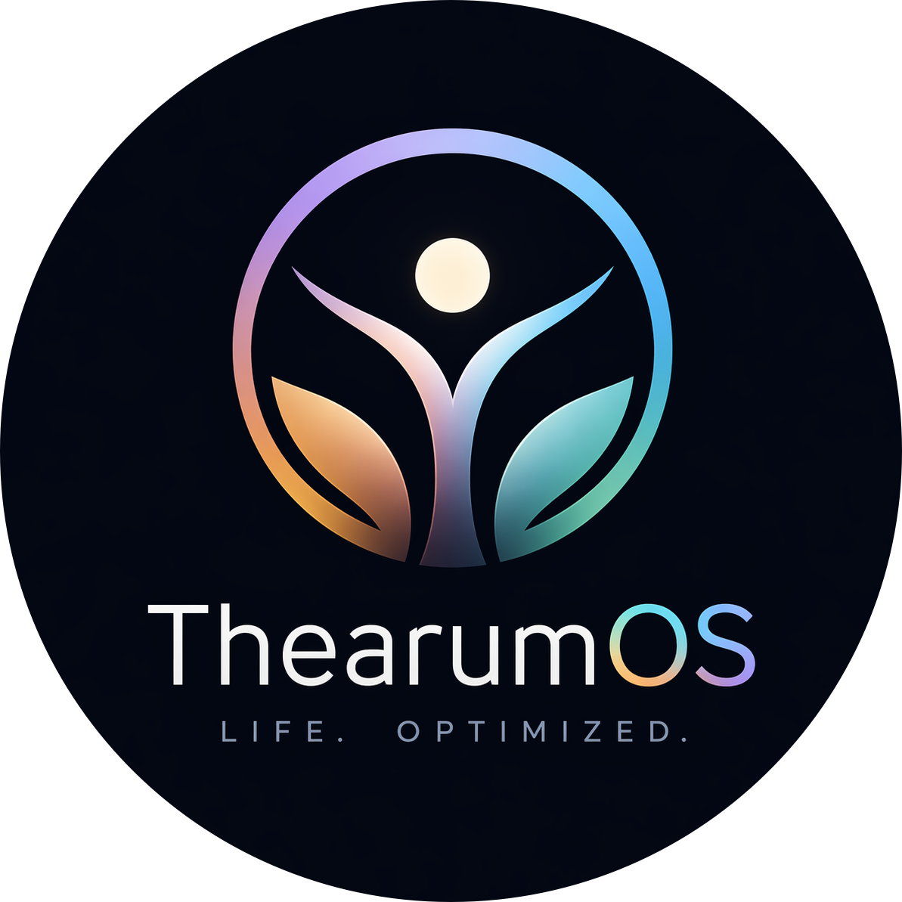

  
  

  <h1>ThearumOS</h1>
  <h2>The Supreme Life Operating System — Local, Private, Insanely Fast.</h2>

  
  
  
  

---

## The Vision

ThearumOS is a high-performance intelligence engine designed for the elite professional. It is built on the philosophy that your life data is sacred. While other apps sell your data to the cloud, ThearumOS keeps everything on your silicon.

## Key Evolutionary Features

- **Total Privacy & Offline Autonomy**: Zero network requests. Zero tracking. Zero cloud. Works 100% offline.
- **AES-256-GCM Encryption**: Military-grade vault for your Finances and Contacts.
- **Typing Intelligence**: System-wide spellcheck, autocorrect, and context-aware capitalization across all 12 modules.
- **Apple-Inspired Aesthetic**: Borderless dynamic logos, Siri-inspired 'Living Glow' animations, and premium haptic-like button scaling.
- **Markdown-Centric Notes**: Automatic JSON-to-Markdown synchronization for portable, platform-independent notes.
- **Machine-Locked Licensing**: Secure, offline activation engine unique to your hardware.
- **30-Step Undo Engine**: Total resilience. Every action is reversible with `⌘Z`.
- **Khmer Localization**: Native support for Khmer numerals and traditional calendar months.

---

## 🛠 12 Intelligence Modules

|    Module     | Focus          | Intelligence                                |
| :-----------: | :------------- | :------------------------------------------ |
| **Dashboard** | Command Center | Live stats & Daily Score                    |
| **Tasks**     | Execution      | Priority-aware todo engine                  |
| **Projects**  | Construction   | Kanban-style roadmap                        |
| **Finance**   | Wealth         | Encrypted Income/Expense/Investment tracker |
| **Health**    | Vitality       | Biometric logs (Weight/Sleep/Water/Gym)     |
| **Habits**    | Consistency    | Visual streak & routine management          |
| **Learning**  | Growth         | Personal Knowledge Base                     |
| **People**    | Network        | Encrypted CRM & Birthday engine             |
| **Notes**     | Second Brain   | AI-assisted thought indexing                |
| **Journal**   | Reflection     | Mood analytics & Memory threading           |
| **Goals**     | Vision         | Long-term objective tracking                |
| **Calendar**  | Timeline       | Visual commitment mapping                   |

---

## 🔒 Security Architecture

1. **Context Isolation**: Renderer processes are fully sandboxed via secure IPC bridges.
2. **Device-Specific Keys**: Encryption keys are local, unique, and never synchronized.
3. **OS-Level Persistence**: Data resides in `~/ThearumOS_Data`, separate from application logic.

---

  Developed by <b>Thearum Rin</b>. Insanely great productivity awaits.

